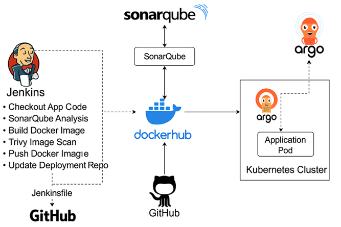

# 🚀 CI/CD Python Web App (Jenkins → SonarQube → Trivy → Docker → Argo CD)

## 🧭 CI/CD Architecture Overview


This architecture diagram represents the complete CI/CD pipeline for automating the build, scan, and deployment of a Python-based web application using industry-standard DevOps tools. The pipeline begins when Jenkins fetches the latest source code from GitHub and performs quality and security checks using SonarQube and Trivy. Once verified, Jenkins builds a Docker image and pushes it to Docker Hub, ensuring version-controlled container storage. The updated image tag is then committed to a separate Kubernetes manifests repository, which is continuously monitored by Argo CD. Upon detecting changes, Argo CD automatically synchronizes the deployment with the Kubernetes cluster, rolling out the latest application version seamlessly. This approach follows a GitOps workflow — where the entire release process, from code commit to production deployment, is automated, auditable, and consistent across environments.

In short, code changes trigger Jenkins → quality checks → Docker build → GitOps update → Argo CD deployment on Kubernetes.

## 📦 Project Overview

This repository contains a Python sample web application plus a Jenkins pipeline that:
1) builds and tests the app with Docker,
2) runs **SonarQube** (code quality) and **Trivy** (image vulnerability) scans,
3) pushes the image to **Docker Hub**, and
4) updates a separate **manifests repo** so **Argo CD** can roll out the new version to Kubernetes.

> **GitOps flow:** App repo (this) → build & scan → push image → **commit image tag** to manifests repo → Argo CD syncs to the cluster.

## 🧰 Tech Stack
Python (sample webapp) • Jenkins • Docker • SonarQube • Trivy • Docker Hub • Argo CD • Kubernetes

## 📂 Repository Structure
/webapp/ # application source code
Dockerfile # container build for the app
Jenkinsfile # CI/CD pipeline (build, scan, push, tag-bump)
README.md
## 🧭 Architecture (high level)
GitHub → Jenkins → SonarQube → Trivy → DockerHub → (commit tag) → Manifests Repo → Argo CD → K8s
## 🏗️ Pipeline Stages (high level)
1. **Checkout** source from GitHub  
2. **Build** Docker image  
3. **SonarQube** analysis (quality gate)  
4. **Trivy** image scan (fail on high/critical)  
5. **Push** image to Docker Hub (e.g., `abkaur95/webapp:<buildNumber>`)  
6. **Bump image tag** in the **manifests repo** (`ci-cd-k8s-manifests/k8s/deployment.yaml`) and push a commit  
7. **Argo CD** detects the manifest change and deploys to the cluster

## 🔗 Linked Repositories
- **Manifests repo (GitOps):** https://github.com/abkaur/ci-cd-k8s-manifests

## 🔐 Required Jenkins credentials (examples)
- `dockerhub-creds` – Docker Hub username/password (or token)
- `git-manifests-creds` – PAT/SSH key to push to manifests repo
- `sonarqube-server` – Jenkins global config for SonarQube server URL/token

## ⚙️ Environment Variables (examples)
- `DOCKER_IMAGE=abkaur95/webapp`
- `MANIFESTS_REPO=https://github.com/abkaur/ci-cd-k8s-manifests.git`
- `MANIFESTS_PATH=k8s/deployment.yaml`

## 🧪 Local Run (optional)

```bash
docker build -t webapp:local .
docker run -p 8010:8010 webapp:local
# open http://localhost:8010


🧠 What I Practiced / Learned:
Successfully implemented an automated end-to-end pipeline where each commit triggers quality and security scans, image build and push, manifest update, and Argo CD deployment

-Designing a multi-stage Jenkins pipeline with quality gates and security checks
-Automating image publishing and GitOps tag bumps
-How Argo CD continuously deploys from a manifests repo
-Reading and editing basic K8s manifests (Deployment, Service)

"Originally forked from a training sample, but I customized the pipeline, added scanning, and implemented a GitOps flow with a separate manifests repository."


